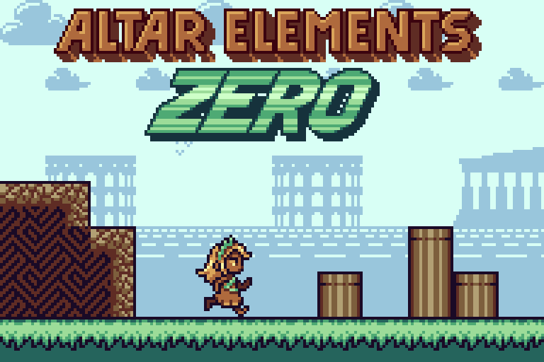

# Altar Elements Zero



> A 2D pixel art platformer built from scratch in C# using the **FNA framework** — no engine, no editor, no physics library.

**[▶ Play the demo on itch.io](https://whiskeneer.itch.io/altar-elements-zero)** · **[🎵 Soundtrack on YouTube](https://www.youtube.com/@Whiskeneer)**

---

## About the Game

Altar Elements Zero is a precision platformer focused on tight, readable movement and level design that teaches through play — no tutorials, no text prompts. Mechanics are introduced implicitly, through the geometry of each room.

The game is in active development. The public demo covers the first area and represents the current state of the engine and content.

**Everything in this repository was written from scratch:** gameplay systems, physics, rendering, level loading, the in-game level editor, and the original soundtrack.

---

## Technical Overview

The project is built on **[FNA](https://fna-xna.github.io/)**, a reimplementation of XNA for modern platforms. FNA provides a window, a graphics device, and audio playback — everything else is implemented from scratch: the game loop, state management, input handling, asset pipeline, level format, and the entire physics and collision system.

**Language:** C# · **Framework:** FNA · **Solution:** Visual Studio (`.slnx`)

### Architecture at a Glance

```
src/
├── states/
│   ├── gameplay/
│   │   ├── Gameplay.cs           — main game loop, collision pipeline orchestration
│   │   ├── gameObject/
│   │   │   ├── GameObject.cs     — physics model, push/separation logic
│   │   │   ├── ObjectBoundingBox.cs — AABB in subpixel space, separation algorithms
│   │   │   └── behaviour/        — per-type update logic (Ora, Scythe, enemies, gimmicks)
│   │   └── level/
│   │       ├── Level.cs          — tile and chunk data
│   │       └── Tile.cs           — tile properties (solid, surface velocity, friction)
│   └── intro/
└── renderer/
```

---

## Physics & Collision System

This was the most demanding part of the project — and the part I'm most proud of. The goal was a system that is **consistent** (same inputs always produce the same outputs), **fair to the player** (never punishes for ambiguous geometry), **versatile** (handles normal air, wind, underwater, and moving platforms in the same pipeline), and **reliable** (no jitter, no tunneling, no phantom collisions).

No physics engine was used. Every behaviour is explicit and reasoned.

### Subpixel Fixed-Point Coordinates

All positions and velocities are stored as **subpixel integers** — a fixed-point system where each screen pixel is subdivided by a power-of-two factor. This gives sub-pixel precision for smooth motion without floating-point arithmetic, eliminating drift and ensuring frame-perfect determinism across machines.

```csharp
// Tile-span narrowing: only check tiles that could possibly overlap
public readonly TileSpan GetTileSpan()
{
    uint up    = Position.Y;
    uint down  = up + Size.Y - 1;
    uint left  = Position.X;
    uint right = left + Size.X - 1;
    return new TileSpan(
        top:    up    >> Configuration.Tile.SubpxPower,
        bottom: down  >> Configuration.Tile.SubpxPower,
        left:   left  >> Configuration.Tile.SubpxPower,
        right:  right >> Configuration.Tile.SubpxPower
    );
}
```

### Axis-Separated Collision Pipeline

Each frame runs through a strict sequence in `Gameplay.cs`:

```
1. CalculateDesiredOutcomes    — behaviours run and set velocity
2. ApplyHorizontalVelocities  — positions advance on X only
3. CheckHorizontalCollisions  — tile + object collisions resolved on X
4. ApplyVerticalVelocities    — positions advance on Y only
5. CheckVerticalCollisions    — tile + object collisions resolved on Y
6. SeparatePushables          — pushable-pushable resolution
7. SeparatePushablesFromImmobile — pushable-vs-immobile + fluid regions
```

Separating the axes eliminates diagonal-corner ambiguity. The velocity cap at one tile per frame prevents tunneling without requiring swept collision.

### The Physics Model

Each physics object accumulates forces through layered impulse sources, resolved in order:

```csharp
public void SimulateRegularObjectPhysics()
{
    currentVelocity = previousVelocity;
    ApplyAirImpulse();          // player/AI intent
    ApplyMediumFriction();      // drag from the surrounding medium
    AppliedForces += Gravity;   // gravity (configurable per chunk)
    Force forcesBeforeGround = AppliedForces;
    TransformForcesIntoVelocity();
    if (PushedPreviouslyUp)     // was grounded last frame
    {
        ApplyGroundImpulse(forcesBeforeGround.Y);  // static or kinematic friction
        TransformForcesIntoVelocity();
    }
    CapDesiredVelocity();
}
```

Key properties of the model:

**Ground friction distinguishes static from kinematic.** If the object has zero net velocity relative to the surface, static friction resists movement up to a maximum. If it is sliding, kinematic friction always opposes motion. This is physics-accurate and produces naturally different feels for walking, skidding, and stopping.

**Medium drag is quadratic.** `friction ∝ v²` is the physically correct model for fluid resistance. This makes underwater movement feel genuinely different — acceleration is fast at low speed and asymptotes toward a terminal velocity — without any special-casing in the behaviour logic.

**Gravity and medium properties are chunk-scoped and swappable at runtime.** Each level chunk can define its own gravity vector and air/fluid friction coefficient. Switching from a normal room to an underwater section is a data change, not a code change.

```csharp
switch (CurrentBackground) {
    case 3: // underwater
        CurrentGravity = new Force(0, 6);
        CurrentAirFriction = 10;
        break;
    default:
        CurrentGravity = new Force(0, 12);
        CurrentAirFriction = 0;
        break;
}
```

### Object Type System and Collision Matrix

Rather than a class hierarchy, objects carry a type tag that drives a **collision response matrix**:

| Type | Behaviour |
|---|---|
| `PUSHABLE` | Affected by all physical forces; can be pushed by anything |
| `IMMOBILE` | Stationary reference (like a moving platform at rest) |
| `UNSTOPPABLE` | Self-moving; pushes pushables, cannot be stopped |
| `FLUID` | Region that sets `VelocityAround` and `FrictionCoefficientAround` for overlapping pushables |
| `PROJECTILE` | Destroyed on contact with solid geometry |
| `REGION` | Trigger zone; no physical response |

When two objects overlap, their type pair determines the resolution: UNSTOPPABLE always pushes PUSHABLE; two PUSHABLEs go through a tie-breaking pass; FLUID affects the medium properties of anything inside it without exerting a discrete force.

### The Lean Functions

Collision resolution never snaps an object to an arbitrary position. Every correction uses a **lean** — a clamped displacement that moves the object by at most the magnitude of its relative velocity, preventing objects from phasing through each other in a single frame while also never teleporting:

```csharp
public void LeanAbove(ObjectBoundingBox other, uint maxDiff)
{
    int desiredPosition = (int)(other.Position.Y - Size.Y);
    int currentPosition = (int)Position.Y;
    int diff = desiredPosition - currentPosition;
    if (diff < -(int)maxDiff) diff = -(int)maxDiff;
    Position.Y += (uint)diff;
}
```

The same pattern applies to `LeanBelow`, `LeanAtLeft`, and `LeanAtRight`. After any lean, `FixVelocity()` recomputes velocity from the delta between the corrected position and the previous frame position — ensuring that velocity and position are always consistent.

### AABB Separation for Object-Object Collisions

For overlapping objects that both need to move (not just lean against each other), the `Separate` family of methods in `ObjectBoundingBox.cs` computes the **minimum penetration axis** and pushes both objects apart along it:

```csharp
// Chooses horizontal or vertical separation based on which overlap is smaller
if (overlappingX < overlappingY)
{
    b1.Position.X -= ov1X;
    b2.Position.X += ov2X;
    return SeparationDirection.LEFT;
}
else
{
    b1.Position.Y -= ov1Y;
    b2.Position.Y += ov2Y;
    return SeparationDirection.UP;
}
```

The returned `SeparationDirection` is used upstream to set push flags and surface friction — so an object resolved upward automatically inherits the correct grounded state and the velocity of whatever it's standing on.

### Linked Objects

Composite actors (e.g. Ora and her scythe) are handled through a **linked-object system** rather than a single large bounding box. The secondary object is a `RESERVED` slot that is repositioned each frame relative to the primary:

```csharp
go1.linkedObject?.currentBoundingBox.Position =
    go1.currentBoundingBox.Position + go1.linkedPosition;
```

This allows the scythe to participate in the interaction system (triggering enemy hit detection) without being subject to the physics pipeline independently.

### Bit-Packed Signal Bus

Objects communicate through a **256-bit signal flag system** — four pairs of `UInt32` registers (128 non-persistent bits, 128 persistent). Non-persistent flags reset on chunk transition; persistent flags survive restarts. This is a zero-allocation event bus for level logic: doors, buttons, checkpoints, and enemies all communicate through flag reads and writes without holding references to each other.

```csharp
// Set flag 42
signalFlags.SetSignalFlag(42, true);

// Read flag 42 from any behaviour
bool isOpen = signalFlags.GetSignalFlag(42);
```

---

## Building

Requirements: **.NET 8** or later, and **FNA** (add as a submodule or reference the NuGet package per your platform).

```bash
git clone https://github.com/whiskeneer/AltarElementsZero.git
cd AltarElementsZero
dotnet build
```

FNA platform-specific native libraries (SDL2, etc.) must be present in the output directory. See the [FNA wiki](https://github.com/FNA-XNA/FNA/wiki) for setup instructions per OS.

---

## Credits

Design, programming, art, and music by **Alexander Moldovan** (Whiskeneer).

- itch.io: [whiskeneer.itch.io](https://whiskeneer.itch.io/)
- YouTube: [youtube.com/@Whiskeneer](https://www.youtube.com/@Whiskeneer)
- LinkedIn: [linkedin.com/in/alexander-moldovan](https://www.linkedin.com/in/alexander-moldovan/)
